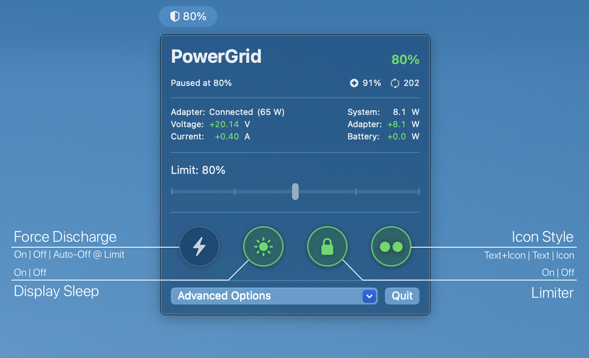

# PowerGrid


PowerGrid is a macOS power management project with two components:
- A privileged daemon (`powergrid-daemon`) that enforces power policy.
- A SwiftUI menu bar app (`PowerGrid.app`) that displays status and sends user-intent mutations.

## Architecture
- Daemon entrypoint: `cmd/powergrid-daemon`
- Daemon internals:
  - `internal/daemon/server` (RPC handlers + orchestration)
  - `internal/daemon/engine` (decision logic)
  - `internal/daemon/session` (console-user preference transitions)
  - `internal/daemon/ipc` (UNIX socket bootstrap + auth)
- App entrypoint: `cmd/powergrid-app/PowerGrid/PowerGrid/PowerGridApp.swift`
- RPC schema: `proto/powergrid.proto`
- Generated Go RPC stubs: `internal/rpc`
- Generated Swift RPC files copied into app: `cmd/powergrid-app/PowerGrid/PowerGrid/internal/rpc`

## Security Model
- Daemon runs as root.
- IPC socket path: `/var/run/powergrid.sock`.
- Socket permission target: `0660`.
- Socket ownership policy:
  - owner: root
  - group: root when no console user; active console user primary group when a user is logged in
- Caller authorization uses peer credentials; allowed callers:
  - root
  - active console user
- State-changing RPCs use typed envelope mutation RPC:
  - `ApplyMutation(MutationRequest)`

## Compatibility Model
PowerGrid uses a two-layer compatibility/upgrade model:

1. Primary gate: protocol semver via `GetDaemonInfo`
- `api_major` mismatch: incompatible (mutations blocked)
- `api_minor` below required: incompatible/degraded
- same major + sufficient minor: compatible

2. Secondary signal: BuildID diagnostics
- BuildID mismatch drives upgrade UX/diagnostics
- BuildID is not the primary compatibility contract

`GetDaemonInfo` also provides:
- `auth_mode`
- `build_id_source` (`git`, `override`, `fallback`, `xcode-derived`, `unknown`)
- `build_dirty`

## Runtime Behavior
- Event-driven first: battery/sleep/wake stream from `powerkit-go`.
- Debounced battery-update coalescing reduces redundant recompute.
- Watchdog fallback periodically recomputes state.
- Hardware operations use bounded timeouts.

## Features
- Charge limit control (60-100) with user/system preference precedence.
- Force discharge.
- Prevent system sleep / display sleep assertions.
- Optional MagSafe LED control (hardware dependent).
- Optional disable-charging-before-sleep policy.
- Low Power Mode read/toggle.
- Live battery and adapter telemetry in app.

## Configuration
Preferences are stored in plist files.

System daemon preferences:
- `/Library/Preferences/com.neutronstar.powergrid.daemon.plist`
- `ChargeLimit` (int, 60-100)

Per-user preferences:
- `~/Library/Preferences/com.neutronstar.powergrid.plist`
- `ChargeLimit` (int, 60-100)
- `ControlMagsafeLED` (bool)
- `DisableChargingBeforeSleep` (bool)

## Build and Tooling Prerequisites
- macOS
- Xcode + Command Line Tools
- XcodeGen (`xcodegen`)
- Go toolchain
- Protobuf toolchain:
  - `protoc`
  - `protoc-gen-go`
  - `protoc-gen-go-grpc`
  - `protoc-gen-swift`
  - `protoc-gen-grpc-swift-2` (or compatible `protoc-gen-grpc-swift`)
- Optional local lint tool:
  - `golangci-lint`

CI bootstraps required toolchain explicitly; local dev should mirror that set.

## Architecture Target Policy
PowerGrid app/test build configuration is Apple Silicon only:
- `ARCHS = arm64`
- `EXCLUDED_ARCHS[sdk=macosx*] = x86_64`

x86_64 is intentionally excluded.

## Build and Verify
From `powergrid/`:

Project generation:
- `make xcodegen`
- `make xcodegen-check`

Proto generation/verification:
- `make proto`
- `make proto-check` (self-contained; regenerates and then verifies)

Go checks:
- `make test`
- `make vet`
- `make lint`

Swift and full verification:
- `make swiftlint`
- `make swift-test`
- `make verify`

App builds:
- `make build` (unsigned)
- `make devsigned` (developer-signed)
- `make archive` / `make export` (distribution lanes)

## Generated Code Policy
Do not hand-edit generated protobuf/gRPC artifacts.

Generation source:
- `proto/powergrid.proto`
- `scripts/gen_proto.sh`

Generated artifacts:
- Go: `internal/rpc/powergrid.pb.go`, `internal/rpc/powergrid_grpc.pb.go`
- Swift (generated + app copy): under `generated/swift` and `cmd/powergrid-app/PowerGrid/PowerGrid/internal/rpc`

Integrity checks:
- `scripts/proto-check.sh`
- `generated/proto.manifest`

## Signing Notes
- Deterministic signing resolution: `scripts/resolve-signing.sh`
- Supported env overrides:
  - `SIGNING_IDENTITY`
  - `DEVELOPMENT_TEAM`
- Local overrides file (gitignored):
  - `cmd/powergrid-app/PowerGrid/Config/Signing.local.xcconfig`
  - template: `cmd/powergrid-app/PowerGrid/Config/Signing.local.xcconfig.example`

## Xcode Sandbox Notes
- Script sandboxing remains enabled.
- `scripts/build-go.sh` is sandbox-safe in Xcode mode:
  - no git calls in Xcode mode
  - deterministic `xcode-derived` BuildID
  - Go outputs staged to `${DERIVED_FILE_DIR}/powergrid-go`
- App resource staging is handled via declared script phase inputs/outputs from `project.yml`.

## Logging
Daemon logs use subsystem `com.neutronstar.powergrid.daemon`.

```bash
log stream --predicate 'subsystem == "com.neutronstar.powergrid.daemon"'
```

## Related Project
PowerGrid uses `powerkit-go` for low-level telemetry/control APIs:
- module dependency currently pinned to `github.com/peterneutron/powerkit-go v0.9.1`
