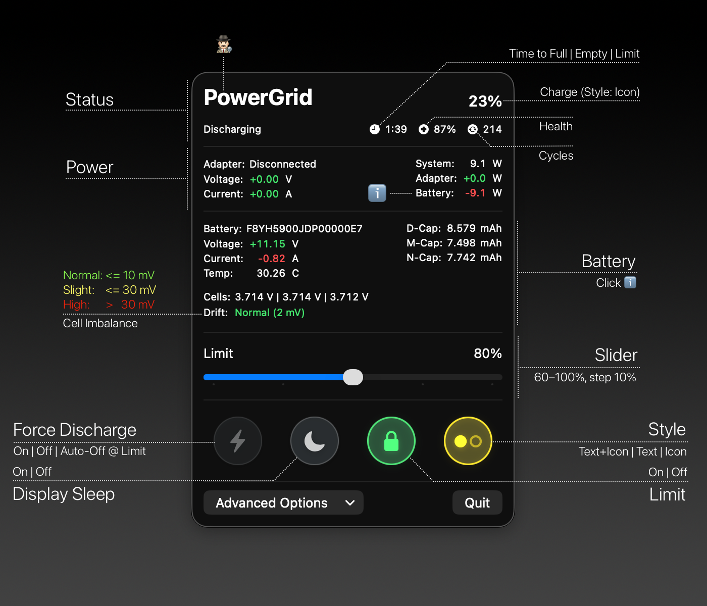

# PowerGrid


---

PowerGrid is a macOS power management tool composed of:
- A root daemon that monitors battery/adapter state and applies charge-limiting logic.
- A SwiftUI menu bar app that installs the daemon and provides controls and status.

> ⚠️ Experimental project
> 
> PowerGrid is a testbed, not a polished product. Interfaces and behaviors may change. If you need a production-ready tool, consider established alternatives. Some noteworthy ones are listed below.
>
> - [batt](https://github.com/charlie0129/batt)
> - [battery](https://github.com/actuallymentor/battery)


## Features

- Menu bar status with icons for charge, charging state, and limiter active.
- Control Center-Inspired Toggles: A grid of beautiful, macOS-style buttons provides immediate, one-click access to essential power management functions like Force Discharge and Prevent Display Sleep.
- Live status: current charge, adapter description, health (%), cycle count.
- Time estimates: Time to Full (while charging) or Time to Empty (while discharging), formatted hh:mm. Time to Full automatically scales to your active charge limit when <100% and hides when full/at limit/paused.
- Power metrics: system, adapter, and battery wattage; adapter input voltage and amperage.
- Charge limit slider from 60–100%.
- Power Assertions: Prevent Display/System Sleep.
- Force Discharge: Discharges even when an adapter is present.
- Force Discharge Automatic: Discharges to your limit, then auto-disables; only selectable above limit.
- Native Notifications: Alerts for key events (e.g., cutoff), single permission prompt.
- Low Power Notifications: Optional alerts at 20% and 10% while discharging; includes an action button to enable macOS Low Power Mode when off.
- Installer flow to install/uninstall the helper daemon with administrator privileges.
- MagSafe LED Control (optional): When enabled in Advanced Options (and supported by hardware), the daemon reflects charging modes on the MagSafe LED.
  - Charging (limit off or below limit): Amber
  - Fully charged or at/above user limit: Green
  - Force Discharge: Off
  - Low battery (≤10%): Error (slow) pattern
  - Safe default: when disabled or on startup, LED is returned to System control

### Low Power Mode

- Toggle macOS Low Power Mode (system-wide) via the daemon. The app includes a “Low Power Notifications” toggle in Advanced Options.
- When enabled, the app posts alerts at 20% and 10% while discharging (debounced with hysteresis), each offering an “Enable Low Power Mode” action if it’s currently off.
- Status includes `low_power_mode_enabled` so the app can hide the action when already enabled.

### Offline Daemon Pairing and Upgrades

- BuildID pairing: The app and daemon are paired offline using a git-based BuildID (derived from `HEAD:cmd/powergrid-daemon`). The daemon reports its BuildID via gRPC, and the app embeds a matching BuildID sidecar for comparison.
- Upgrade flow: On app start, if the embedded BuildID differs from the installed daemon's BuildID, the app offers an "Upgrade Daemon" flow (reuses the installer).
- Dev convenience: If the app is built from a dirty working tree, the embedded BuildID is suffixed with `-dirty`. In this case, the app proactively offers an upgrade and also shows a "Skip for now" option so you can continue a dev session with the existing daemon.
- Developer submenu: In dirty builds, Advanced Options shows a "Developer" submenu with short forms of both BuildIDs and tooltips with full hashes.

## Getting Started: Building from Source

This project uses a `Makefile` to automate the build process.

#### 1. Prerequisites

- macOS with Xcode installed.
- Go toolchain.
- Homebrew for installing protobuf dependencies:
  ```bash
  brew install protobuf swift-protobuf grpc-swift
  ```

#### 2. One-Time Setup in Xcode

Before you can build from the command line, you need to configure code signing once in Xcode.

1.  Open `PowerGrid.xcodeproj` in Xcode.
2.  In the project navigator, select the "PowerGrid" project, then the "PowerGrid" target.
3.  Go to the **"Signing & Capabilities"** tab.
4.  From the **"Team"** dropdown, select your personal Apple ID. Xcode will automatically create a local development certificate for you.
5.  You can now close Xcode.

#### 3. Build the App

From the root of the project directory, run the main `make` command:

```bash
make
```
This command will:
- Generate the necessary gRPC Swift and Go code.
- Copy the Swift files into the Xcode project.
- Build and archive the application.
- Export a clean, runnable `PowerGrid.app` into a `./build` directory.

Notes on version pairing and build artifacts:
- During the build, the daemon is compiled with an ldflags-stamped `BuildID` and a sidecar file `powergrid-daemon.buildid` is produced and bundled into the app. This avoids coupling hashes to code signing.
- The app compares its embedded `BuildID` to the daemon's `GetVersion` response on first connection to decide if an upgrade prompt is needed.

You can now run the app from the `./build` folder.

## Development Workflow

The `Makefile` provides several targets to streamline development:

- `make`: The default command. Creates a final, optimized `.app` bundle in the `./build` directory.
- `make proto`: Run this after editing `proto/powergrid.proto` to regenerate the gRPC code for both Swift and Go.
- `make clean`: Removes all build artifacts and generated code to start fresh.
- `sudo -E go run ./cmd/powergrid-daemon`: Run the daemon directly for debugging (requires root).

gRPC interfaces:
- `GetStatus`: App polling for live status (now includes `time_to_full_minutes` and `time_to_empty_minutes`).
- `SetChargeLimit`, `SetPowerFeature`: App controls for charging limit and power assertions/force discharge/Low Power Mode.
- `GetVersion`: Returns the daemon's `BuildID` used for offline pairing.

Status fields (selection):
- `time_to_full_minutes`, `time_to_empty_minutes` for estimates.
- `magsafe_led_supported`, `magsafe_led_control_active`.
- `low_power_mode_enabled` (parsed from `pmset -g`).

### MagSafe LED Control

- Availability: Only on hardware with MagSafe LED. The app detects support and greys out the toggle with a caption when unsupported.
- Toggle: Advanced Options → "Control MagSafe LED". The preference is persisted per-user and applied by the daemon across restarts.
- Behavior: When enabled and an adapter is present, the daemon sets the LED per state mapping above; when disabled, it writes System control back to firmware.

## How It Works

- **Daemon (`cmd/powergrid-daemon`):** Runs as root, exposing a gRPC API over a Unix socket at `/var/run/powergrid.sock`. It reacts to system power events, tracks the active user, and persists their charge limit preferences.
- **App (`PowerGrid.xcodeproj`):** A SwiftUI menu bar app that communicates with the daemon. It bundles a helper tool to manage the installation and uninstallation of the daemon and its `launchd` service.

## Configuration

The daemon stores its configuration under `/Library/Application Support/com.neutronstar.powergrid/`. It uses a user > system > default hierarchy to determine the effective charge limit.
- `system.json`: System-wide default charge limit.
- `users/<uid>.json`: Per-user overrides.

## Logging

All daemon activity is logged to the macOS Unified Logging system. You can view logs using Console.app or the command line:
```bash
log stream --predicate 'subsystem == "com.neutronstar.powergrid.daemon"'
```

## Acknowledgments

- Built on [PowerKit-Go](https://github.com/peterneutron/powerkit-go) for IOKit/SMC access and event streaming.
- Google Gemini and OpenAI GPT families of models and all the labs involved making these possible 🙏
